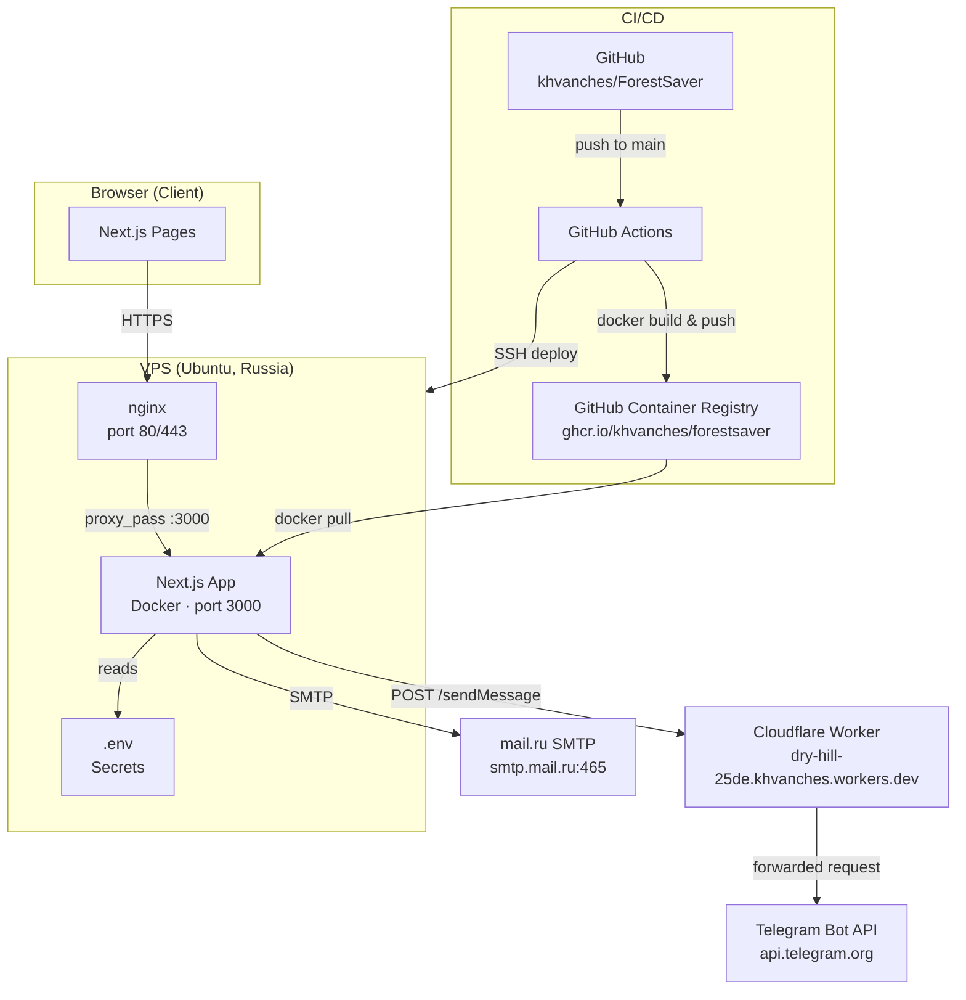
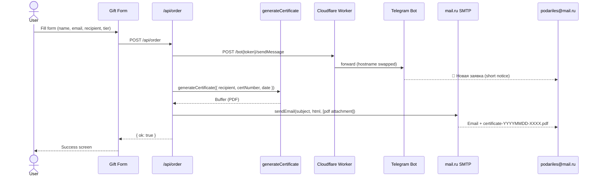
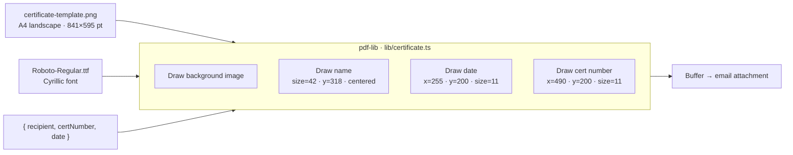
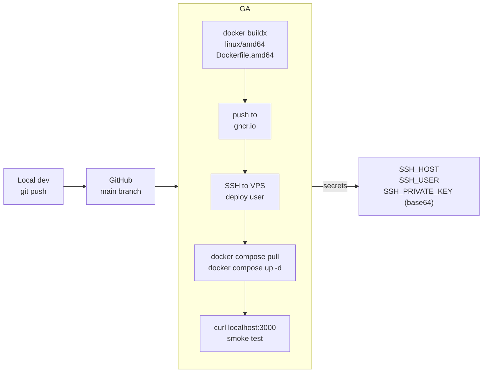

# ForestSaver — Architecture

## System Overview



---

## Order Flow (POST /api/order)



---

## Certificate Generation



---

## CI/CD Pipeline



---

## Infrastructure

```
podariles.ru (DNS A → VPS IP)
    │
    ▼
nginx (Let's Encrypt TLS)
    │  proxy_pass http://localhost:3000
    ▼
Docker container (ghcr.io/khvanches/forestsaver:latest)
    │
    ├── Next.js App (standalone output)
    ├── /public/images/   — compressed JPEGs (~4 MB total)
    ├── /public/fonts/    — Roboto-Regular.ttf
    └── reads .env        — /home/deploy/forestsaver/.env

Telegram blocked on VPS → routed via Cloudflare Worker (free tier, 100k req/day)
```

---

## Key Files

| Path | Role |
|------|------|
| `app/api/order/route.ts` | Order handler: Telegram + email + PDF |
| `app/api/contact/route.ts` | Contact handler: Telegram + email |
| `lib/certificate.ts` | PDF certificate generator |
| `lib/email.ts` | Nodemailer wrapper (mail.ru SMTP) |
| `components/gift-section.tsx` | Order form + dialog (currently shows mailto fallback) |
| `Dockerfile.amd64` | Production image (linux/amd64) |
| `.github/workflows/deploy.yml` | CI/CD pipeline |
